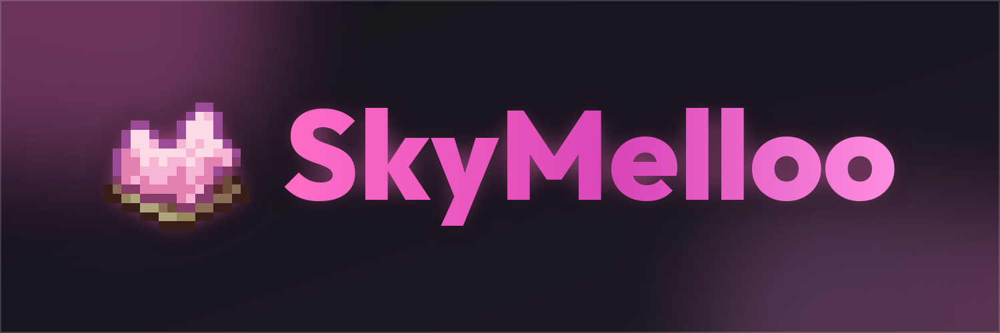

[](LICENSE)
[](https://fabricmc.net/)
[](https://fabricmc.net/)
[](https://github.com/SkyMelloo/MellooEssentials)
[](https://sky.melloo.me)

> [!NOTE]
> No public release is planned yet - this is still full active development, no ETA on a first
> public version. Interested in helping out? Reach out on Discord: **hexedmaya**.

A [Fabric](https://fabricmc.net/) client mod for Hypixel SkyBlock dungeons - dungeon tracking,
party tools, and player highlighting - paired with a companion website at
[sky.melloo.me](https://sky.melloo.me) for a live/replay dungeon map and account dashboard.

Requires [MellooEssentials](https://github.com/SkyMelloo/MellooEssentials) installed alongside it
- that's where the shared core (cosmetics, connection/player-info HUDs, presence) lives.

Not an official Minecraft product. Not approved by or associated with Mojang, Microsoft, or
Hypixel Inc.

## Features

- **Dungeon tracking** - live Score HUD, death recap, kill/room/secret tracking, and a boss-room
  3D preview.
- **Party tools** - per-member stats, auto-kick rules, join watcher.
- **Highlighting** - party members, SkyMelloo staff, and current-room dungeon mobs each get their
  own color. No general-purpose highlighting of every player/mob on the server.
- **Sync** - live status and (opt-in) dungeon-run data shared with sky.melloo.me for the
  live/replay dungeon map.
- **Cloud Saves** - your settings follow you to a new device/reinstall automatically, using only
  your Minecraft account's own identity - no sky.melloo.me account needed.
- Also includes spell effects and a few other small cosmetic touches.

## Download

The official, signed build is only ever distributed from **[sky.melloo.me/download](https://sky.melloo.me/download)**.
If you got a jar from anywhere else, it isn't an official release - see Building below to make
your own from this source instead.

## Building

Requires JDK 25.

```
node scripts/build.js
```

Asks a couple of questions and runs Gradle for you. Prefer raw Gradle directly?

```
./gradlew build -PtestBuild=true           # unsigned test build, no key or changelog needed
./gradlew build -PchangelogFile=path.txt   # signed build, requires a private key you won't have
```

A test build is fully functional and shareable - this is AGPL-3.0.

## Community

Bug reports and feature requests go through the [website's Report a Bug
form](https://sky.melloo.me/report-bug) or GitHub Issues here. See
[CODE_OF_CONDUCT.md](CODE_OF_CONDUCT.md) for community expectations and
[SECURITY.md](SECURITY.md) if you've found a vulnerability.

## License

[GNU Affero General Public License v3.0](LICENSE). Copyright (C) 2026 Maja Bekurdts (hexedmaya).
Modified versions must be clearly marked as unofficial (see the additional term at the top of
[LICENSE](LICENSE)).

## Contact

[sky.melloo.me/contact](https://sky.melloo.me/contact)
